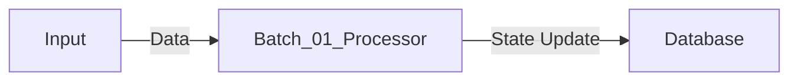

# Data Flow Diagram: Batch_01

```mermaid
graph LR;
  Input --> |Data| Batch_01_Processor;
  Batch_01_Processor --> |State Update| Database;
```
## Interactions
Data exchanges primarily with: re, audit_logger, __future__
