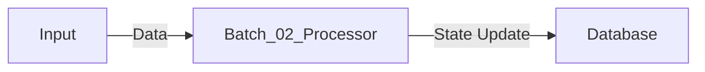

# Data Flow Diagram: Batch_02

```mermaid
graph LR;
  Input --> |Data| Batch_02_Processor;
  Batch_02_Processor --> |State Update| Database;
```
## Interactions
Data exchanges primarily with: streamlit.proto.Common_pb2, base64, core.llm.client, core.tools.system_automation, core.runtime.import_validator
