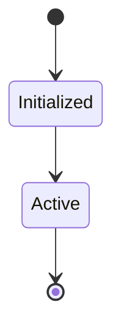

# State Machine: Batch_02

## Captured State Transitions
- **core\controller_v2.py**: state_machine
- **core\automation\live_automation.py**: state_file
- **core\autonomy\goal_manager.py**: status
- **core\autonomy\scheduler.py**: status
- **core\context\context.py**: state_machine
- **core\controller\memory_subsystem.py**: memory_status
- **core\desktop\mission.py**: status
