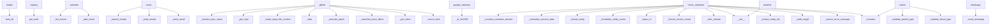

# Intra-Batch Call Graph: Batch_03

```mermaid
graph TD;
  loader --> load_all;
  registry --> get_tools;
  calendar --> _add_event;
  calendar --> _list_events;
  email --> _send_email;
  email --> _read_emails;
  email --> _search_emails;
  github --> _coerce_limit;
  github --> _get_client;
  github --> _matches_issue_filters;
  github --> _truncate_patch;
  github --> _take;
  github --> _make_input_file_content;
  github --> _get_repo;
  github --> _resolve_repo_name;
  google_calendar --> _to_rfc3339;
  home_assistant --> _extract_error_message;
  home_assistant --> _build_target;
  home_assistant --> _headers;
  home_assistant --> _extract_entity_ids;
  home_assistant --> _infer_domain;
  home_assistant --> _format_service_result;
  home_assistant --> _base_url;
  home_assistant --> __init__;
  home_assistant --> _invalidate_entity_cache;
  home_assistant --> _format_entity;
  home_assistant --> _normalize_service_data;
  home_assistant --> _contains_sensitive_domain;
  notion --> _headers;
  notion --> _validate_block_type;
  notion --> _validate_parent_type;
  weather --> __init__;
  whatsapp --> _send_whatsapp;
```
