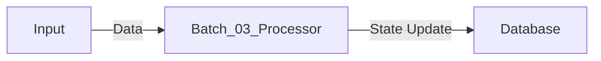

# Data Flow Diagram: Batch_03

```mermaid
graph LR;
  Input --> |Data| Batch_03_Processor;
  Batch_03_Processor --> |State Update| Database;
```
## Interactions
Data exchanges primarily with: urllib.request, urllib.parse, time, base64, email
