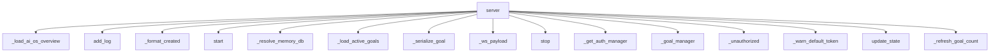

# Intra-Batch Call Graph: Batch_04

```mermaid
graph TD;
  server --> _load_ai_os_overview;
  server --> add_log;
  server --> _format_created;
  server --> start;
  server --> _resolve_memory_db;
  server --> _load_active_goals;
  server --> _serialize_goal;
  server --> _ws_payload;
  server --> stop;
  server --> _get_auth_manager;
  server --> _goal_manager;
  server --> _unauthorized;
  server --> _warn_default_token;
  server --> update_state;
  server --> _refresh_goal_count;
```
