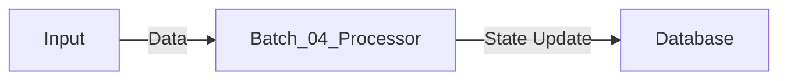

# Data Flow Diagram: Batch_04

```mermaid
graph LR;
  Input --> |Data| Batch_04_Processor;
  Batch_04_Processor --> |State Update| Database;
```
## Interactions
Data exchanges primarily with: uuid, time, shutil, fastapi.staticfiles, core.tools.gui_control
