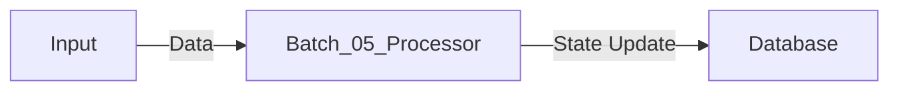

# Data Flow Diagram: Batch_05

```mermaid
graph LR;
  Input --> |Data| Batch_05_Processor;
  Batch_05_Processor --> |State Update| Database;
```
## Interactions
Data exchanges primarily with: uuid, time, core.llm.model_spec, core.tools.builtin_tools, core.tools.system_automation
