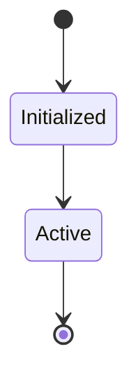

# State Machine: Batch_05

## Captured State Transitions
- **tests\unit\test_agent_loop_failure.py**: execution_status
- **tests\unit\test_controller_v2_regression.py**: state_machine
- **tests\unit\test_dag_executor.py**: execution_status
- **tests\unit\test_ollama_retry.py**: status
