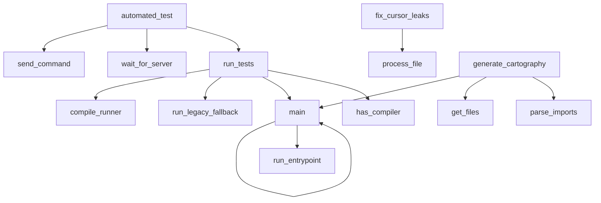

# Intra-Batch Call Graph: Batch_06

```mermaid
graph TD;
  automated_test --> send_command;
  automated_test --> wait_for_server;
  automated_test --> run_tests;
  fix_cursor_leaks --> process_file;
  generate_cartography --> main;
  generate_cartography --> get_files;
  generate_cartography --> parse_imports;
  main --> main;
  main --> run_entrypoint;
  run_tests --> compile_runner;
  run_tests --> run_legacy_fallback;
  run_tests --> main;
  run_tests --> has_compiler;
```
