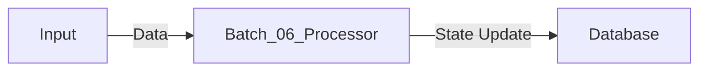

# Data Flow Diagram: Batch_06

```mermaid
graph LR;
  Input --> |Data| Batch_06_Processor;
  Batch_06_Processor --> |State Update| Database;
```
## Interactions
Data exchanges primarily with: time, core.controller_v2, shutil, aiosqlite, ast
