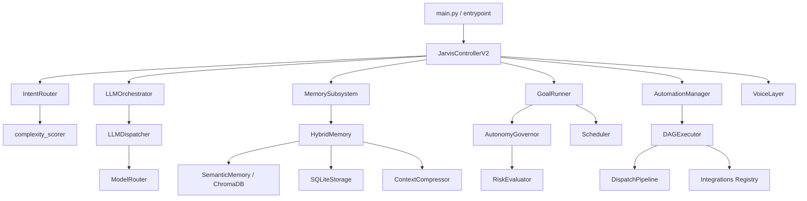
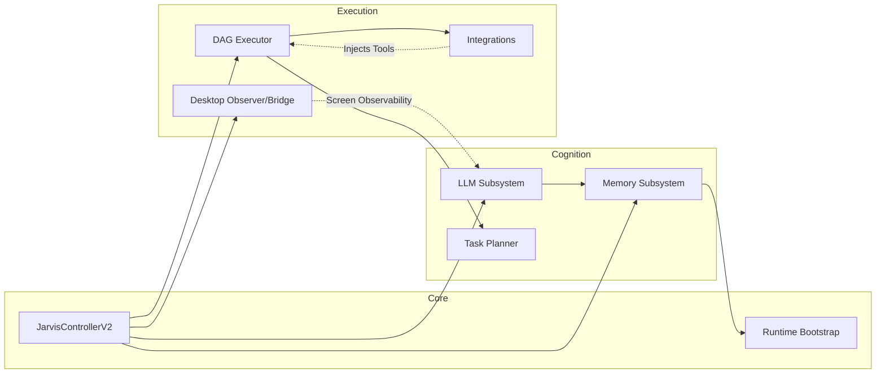
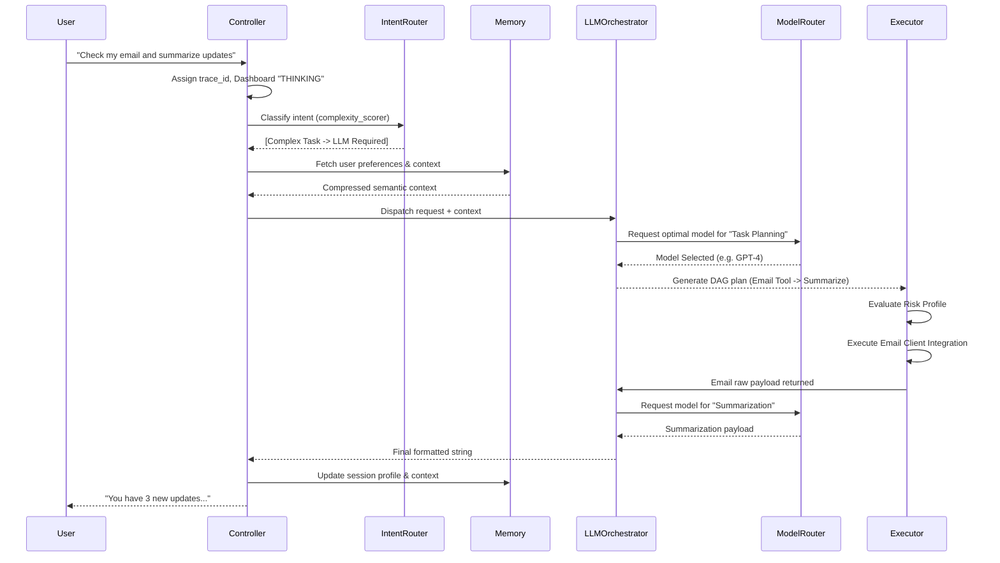
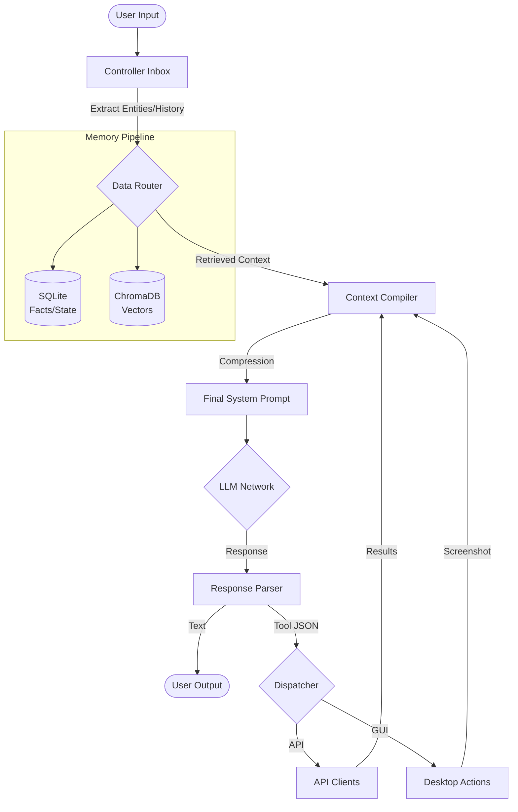

# Architecture Overview

## 1. System Overview
Jarvis is an advanced, autonomous AI assistant built with a highly modular and extensible architecture. Designed to operate seamlessly across different modalities—including Voice, GUI (Dashboard), and Headless CLI modes—it acts as an agentic framework. At its core, Jarvis combines Large Language Model (LLM) orchestration, hybrid memory (Semantic/RAG + Relational), complex DAG-based execution planning, and desktop automation to act on behalf of the user. 

The system leverages asynchronous, event-driven execution loops built in Python, heavily prioritizing extensibility via a plugin/integration registry and safe, autonomous execution through strict risk evaluation.

---

## 2. Architectural Patterns

1. **Facade & Subsystem Orchestration**
   The main controller (`JarvisControllerV2`) acts as the top-level orchestration facade. Rather than housing all logic, it delegates to distinct bounded context subsystems (e.g., `LLMOrchestrator`, `MemorySubsystem`, `AutomationManager`, `GoalRunner`). Subsystems follow a standardized interface and are synchronized concurrently on startup/shutdown via Python's `asyncio.TaskGroup` inside `BaseController`.

2. **Intent Routing & Complexity Scoring**
   Every request undergoes a pre-flight heuristic evaluation via `complexity_scorer`. The `IntentRouter` intercepts simple, deterministic commands (e.g., preference setting, immediate goal modifications) and routes them to fast-path handlers (`handle_goal_intent`, `handle_preference_intent`). Complex queries fall back to the generative `LLMOrchestrator`.

3. **Hybrid RAG & Memory Compression**
   The architecture heavily integrates contextual memory. It relies on a `HybridMemory` structure combining a relational SQLite datastore (`sqlite_storage`) for transactional/factual data, and a vector database (ChromaDB) for semantic embeddings. To maximize token efficiency, a `context_compressor` dynamically truncates or summarizes retrieved context.

4. **Agentic Execution Engine (DAG Pipeline)**
   Instead of raw functional tool calling, multi-step actions are formulated into Directed Acyclic Graphs (DAGs). The `DispatchPipeline` (`core.execution.dispatcher`) and `DAGExecutor` execute interconnected steps with enforced depth bounds (recursion limits) to prevent runaway loops.

5. **Proactive Autonomy & Governance**
   The architecture features an `autonomy_governor` and a `risk_evaluator` that validate actions before execution. Combined with a `background_monitor` and `scheduler`, Jarvis can execute proactive background tasks (e.g., checking due goals) without explicit real-time user prompts.

---

## 3. Bounded Contexts & Subsystem Responsibilities

### 3.1. Core Controller & Introspection (`core.controller`, `core.runtime`, `core.introspection`)
- **`JarvisControllerV2`**: Main runtime entrypoint. Synchronizes all submodules, delegates queries, and handles user session state loops.
- **`IntentRouter` & `complexity_scorer`**: Evaluates request load, determining if the LLM is needed or if native code should handle it immediately.
- **`runtime.bootstrap` & `entrypoint`**: Environment hydration, config overrides (`jarvis.ini` + `.env`), and OS-level shutdown signal handling.
- **`Health Monitoring`**: Lightweight and deep health checks to ensure vector DBs, LLM APIs, and integrations are online.

### 3.2. LLM Orchestration & Routing (`core.llm`, `core.controller.llm_orchestrator.py`)
- **`LLMDispatcher`**: Manages exact API calls to underlying models (e.g., OpenAI, Ollama, Claude).
- **`ModelRouter`**: Dynamically routes prompts to specific models based on task nature (e.g., fallback logic, distinct models for `vision`, `planning`, `chat`, or `intent_classification`).

### 3.3. Memory & Context Retrieval (`core.memory`)
- **`HybridMemory`**: Entrypoint for storing/retrieving knowledge.
- **`code_indexer`**: Scans user codebases locally to enable Jarvis to assist as a coding copilot.
- **`context_compressor`**: Mitigates context window limits.

### 3.4. Execution & Tools (`core.executor`, `core.execution`, `core.automation`, `core.desktop`)
- **`DAGExecutor`**: Safely evaluates dependent nodes of execution.
- **`AutomationManager`**: Manages long-running system tasks, file operations, RAG ingestion loops, and OS interactions.
- **`Desktop Executor/Observer`**: Leverages PyAutoGUI/Vision components to automate mouse clicks, typing, and screenshot analysis.

### 3.5. Proactive Autonomy (`core.autonomy`, `core.proactive`)
- **`GoalRunner`**: Monitors user-defined goals, re-evaluating persistence and triggering tasks when scheduled times arrive.
- **`RiskEvaluator`**: Security layer validating if an automation request risks data loss or exceeds current configured autonomy bounds.

### 3.6. Integrations & Plugins (`integrations`)
- **`IntegrationLoader`**: A registry-based system importing tools dynamically. Includes modules for `github`, `spotify`, `home_assistant`, `google_calendar`, `notion`, `email`, etc.

---

## 4. Component Hierarchy

---

## 5. Dependency Graph

---

## 6. Request Lifecycle

The lifecycle demonstrates how user queries pass from the top-level loop through various cognitive evaluations down to concrete execution.

---

## 7. Data Flow Diagram

