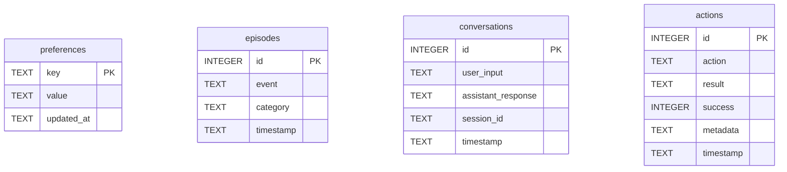
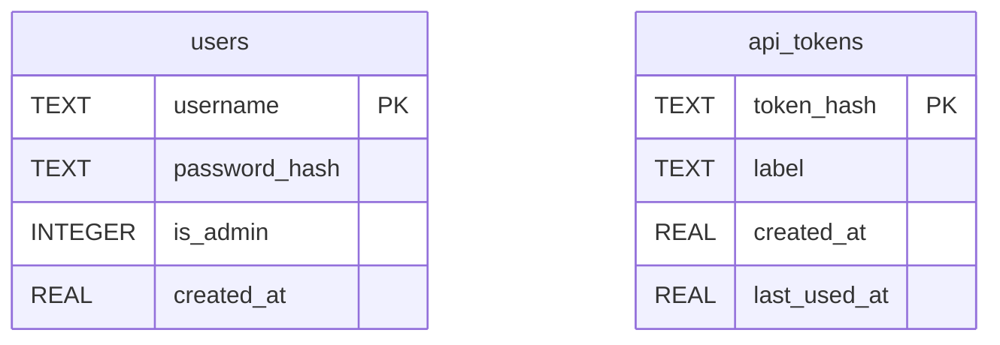
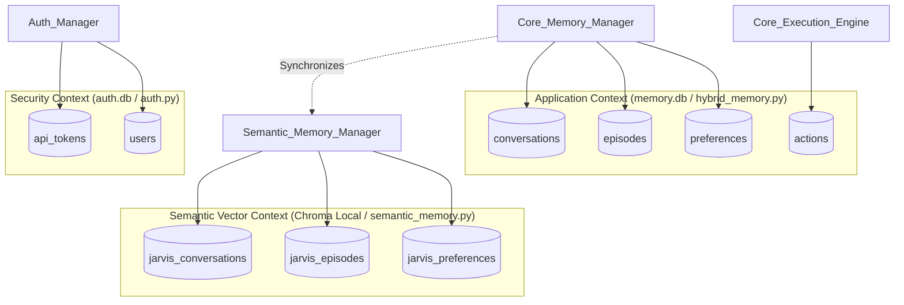

# Data Model Specification

This document provides a comprehensive analysis of all persistence layers, schemas, and models within the Jarvis project. The application utilizes a hybrid database approach:
1. **SQLite Database (`memory.db`)** for Application state (preferences, history, actions).
2. **SQLite Database (`auth.db`)** for Security and Authentication state.
3. **ChromaDB Local Vector Store** for Semantic Memory (vector similarity search).

There are no strict Object-Relational Mappers (ORMs) such as SQLAlchemy or Prisma used. Instead, data interactions are executed directly using raw SQL queries with standard database drivers (`sqlite3` and `aiosqlite`).

---

## 1. Relational Persistence (Application & Memory)

Managed primarily via `core/memory/sqlite_storage.py`, `core/memory/hybrid_memory.py`, and `core/memory/sqlite_pool.py`.

### ER Diagram

*Note: Due to the decoupled nature of these telemetry/memory entities, there are no defined direct foreign keys.*

### Table: `preferences`
Stores generic key-value preferences defined implicitly or explicitly by user interactions.

*   **Fields**:
    *   `key` (`TEXT`, **Primary Key**): The unique identifier for the preference.
    *   `value` (`TEXT`): The value string of the preference.
    *   `updated_at` (`TEXT`): ISO 8601 formatted timestamp of the last modification (Added via migration).
*   **Constraints**: Primary Key on `key`.
*   **Indexes**:
    *   `idx_preferences_updated_at`: Index on `updated_at DESC`.

### Table: `episodes`
Records sequential events or context points (episodic memory).

*   **Fields**:
    *   `id` (`INTEGER`, **Primary Key**): Auto-incremented event ID.
    *   `event` (`TEXT`): Summary or description of the event.
    *   `category` (`TEXT`): Category tag for the event (e.g., "general").
    *   `timestamp` (`TEXT`): ISO 8601 formatted timestamp (Added via migration).
*   **Constraints**: Primary Key on `id`.
*   **Indexes**:
    *   `idx_episodes_timestamp`: Index on `timestamp DESC`.

### Table: `conversations`
Stores chronological turn-by-turn conversational history.

*   **Fields**:
    *   `id` (`INTEGER`, **Primary Key**): Auto-incremented conversation turn ID.
    *   `user_input` (`TEXT`): The user's query or command.
    *   `assistant_response` (`TEXT`): The system's generated response.
    *   `session_id` (`TEXT`): Grouping ID tying conversational turns to a specific session.
    *   `timestamp` (`TEXT`): ISO 8601 formatted timestamp (Added via migration).
*   **Constraints**: Primary Key on `id`.
*   **Indexes**:
    *   `idx_conversations_timestamp`: Index on `timestamp DESC`.

### Table: `actions`
Maintains an audit trail of autonomous tool and action execution.

*   **Fields**:
    *   `id` (`INTEGER`, **Primary Key, AUTOINCREMENT**): Auto-incremented action ID.
    *   `action` (`TEXT`, **NOT NULL**): The name or signature of the action taken.
    *   `result` (`TEXT`): String representation of the action's execution output.
    *   `success` (`INTEGER`, **NOT NULL, DEFAULT 1**): Boolean integer flag denoting success (1) or failure (0).
    *   `metadata` (`TEXT`): Serialized JSON string containing supplementary action parameters and payload context.
    *   `timestamp` (`TEXT`, **NOT NULL**): ISO 8601 formatted timestamp (Added via migration).
*   **Constraints**: Primary Key on `id`.
*   **Indexes**:
    *   `idx_actions_timestamp`: Index on `timestamp DESC`.

---

## 2. Relational Persistence (Security & Auth)

Managed securely via `core/security/auth.py`. 

### ER Diagram

### Table: `users`
Accounts permitted to authenticate via the UI or CLI layers.

*   **Fields**:
    *   `username` (`TEXT`, **Primary Key**): The unique login handle.
    *   `password_hash` (`TEXT`, **NOT NULL**): Bcrypt or PBKDF2 hashed secret.
    *   `is_admin` (`INTEGER`, **NOT NULL, DEFAULT 1**): Access role level flag (1=admin, 0=standard user).
    *   `created_at` (`REAL`, **NOT NULL**): Unix epoch floating point timestamp.
*   **Constraints**: Primary Key on `username`.

### Table: `api_tokens`
Tokens configured to grant automated service or CLI access, existing independently of specific user accounts (system-level scope mapping).

*   **Fields**:
    *   `token_hash` (`TEXT`, **Primary Key**): SHA-256 HMAC digest of the API token (the raw token is never stored).
    *   `label` (`TEXT`, **NOT NULL**): Human-readable identifier assigned upon creation (e.g., "automation").
    *   `created_at` (`REAL`, **NOT NULL**): Unix epoch floating point timestamp.
    *   `last_used_at` (`REAL`): Unix epoch floating point timestamp updated upon verification.
*   **Constraints**: Primary Key on `token_hash`.

---

## 3. Vector Persistence (Semantic Memory)

ChromaDB is used as a local vector database to store and retrieve unstructured text for semantic context injections. Managed via `core/memory/semantic_memory.py`.

### Collection: `jarvis_preferences`
*   **Purpose**: Allows retrieval of specific user preferences by vector similarity of incoming user requests.
*   **ID Strategy**: `pref_{key}`
*   **Vectorization Content**: Document formulated as `{key}: {value}`.
*   **Associated Metadata**:
    *   `key`: Text identifier.
    *   `value`: Preference payload.
    *   `updated_at`: ISO 8601 timestamp string.

### Collection: `jarvis_episodes`
*   **Purpose**: Allows fuzzy recollection of past context events without depending on exact keyword matching.
*   **ID Strategy**: `ep_{uuid4()[:12]}`
*   **Vectorization Content**: Document is the raw `{event}` text.
*   **Associated Metadata**:
    *   `category`: String categorization tag.
    *   `timestamp`: ISO 8601 timestamp string.

### Collection: `jarvis_conversations`
*   **Purpose**: Retrieves prior relevant conversational turns based on conversational semantic distance.
*   **ID Strategy**: `conv_{uuid4()[:12]}`
*   **Vectorization Content**: Document formulated as `User: {user_input}\nAssistant: {assistant_response}`.
*   **Associated Metadata**:
    *   `user_input`: The user's query context.
    *   `assistant_response`: The AI's prior response.
    *   `session_id`: Unique identifier referencing the chat thread.
    *   `timestamp`: ISO 8601 timestamp string.

---

## 4. Data Ownership Map

The data layer employs strict physical boundaries reflecting domains of concern.

**Ownership Summary**:
1.  **`AuthManager`** (`core/security/auth.py`): Absolute ownership of Auth Data (`users`, `api_tokens`). Interacts solely with `auth.db`.
2.  **`SQLiteStorage` & `HybridMemory`** (`core/memory/sqlite_storage.py`): Master authoritative ownership of the precise textual history (`memory.db` entities).
3.  **`SemanticMemory`** (`core/memory/semantic_memory.py`): Subordinate mapping of the Application Context into dense vectors. Mirrors `memory.db` contents loosely to provide relevance-scored text search.

### Additional Notes on Data Mechanics
*   **Migrations**: Explicit migration tools (like Alembic) are not present. Instead, schema evolution logic happens on connection initialization (e.g., executing idempotent `ALTER TABLE ... ADD COLUMN` statements and silencing `Exception`s if columns already exist, observed in `init_schema()`).
*   **Transactions**: Relying strictly on SQLite's standard ACID properties (using `PRAGMA journal_mode=WAL;` to allow multi-reader/single-writer semantics without blocking readers).
