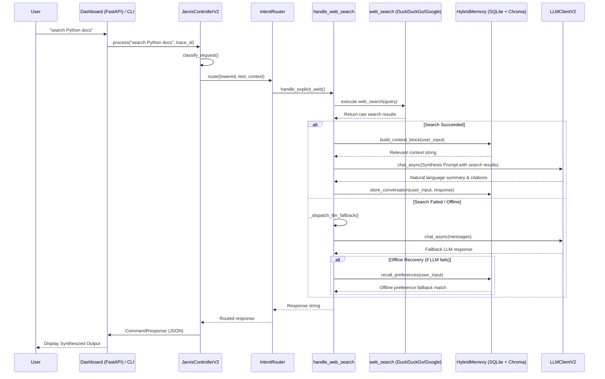
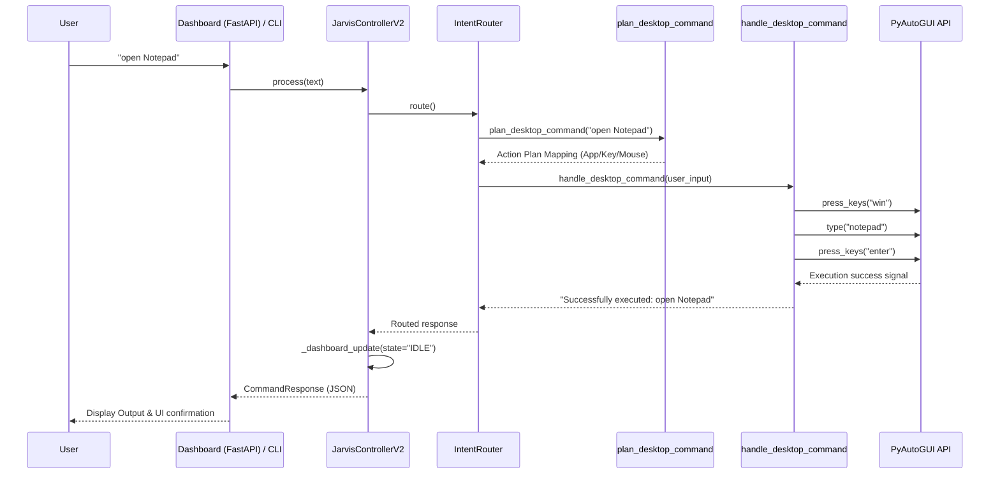
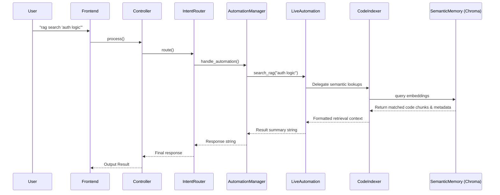
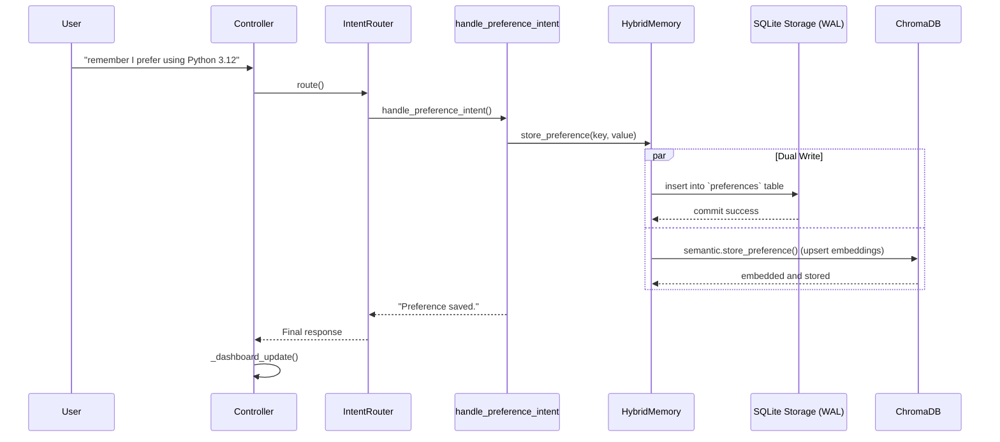
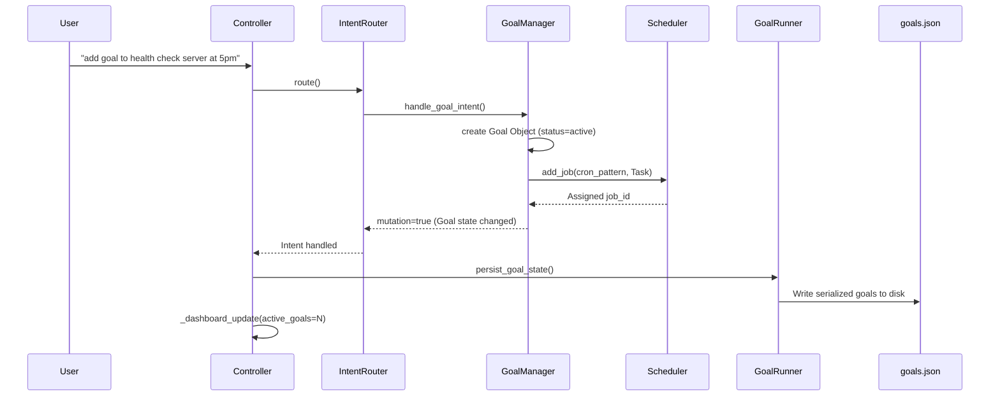

# End-to-End Execution Flows

## Overview
The Execution flows illustrate how user commands traverse the various architectural layers of the Jarvis AI system. The primary entry point is either the CLI (via standard input) or the Dashboard UI (FastAPI `/command` endpoint). Both pathways terminate at `JarvisControllerV2.process()`, which serves as the core orchestration junction. The `IntentRouter`, `AgentLoopEngine`, `AutomationManager`, and supporting subsystems determine the exact sequence of backend execution paths.

Below are the exhaustive traces for major system behaviors.

---

## 1. Web Search & LLM Fallback Flow
Triggered by explicit web search requests (e.g., *"search Python docs"*). If the web tool fails or is disabled, the system gracefully degrades to an LLM fallback coupled with local semantic memory.



---

## 2. Desktop Automation Execution Flow
Triggered by OS control requests (e.g., *"open Notepad"*, *"click on the browser"*).



---

## 3. Agentic / Planner Flow (DAG Task Execution)
Triggered by complex or multi-step requests requiring high autonomy, reasoning, and tool use (e.g., *"Analyze my logs and generate a markdown report"*).

```mermaid
sequenceDiagram
    participant User
    participant Frontend
    participant Controller
    participant Router as IntentRouter
    participant Planner as TaskPlanner
    participant Loop as AgentLoopEngine
    participant DAG as DAG Executor
    participant Tools as ToolRegistry (System)
    participant LLM as Ollama / LLMClientV2
    
    User->>Frontend: "Analyze logs and generate report"
    Frontend->>Controller: process()
    
    Controller->>Controller: classify_request() -> complexity > 0.5, route="planner"
    Controller->>Router: route()
    Router->>Planner: handle_agentic() -> plan(user_input)
    Planner->>LLM: generate execution steps
    LLM-->>Planner: JSON DAG Execution Plan
    Planner-->>Router: Validated Execution Plan
    
    Router->>Loop: run(goal, plan, TaskExecutionContext)
    Loop->>Loop: _ensure_thinking_state() / transition(PLANNING)
    
    Loop->>Loop: RiskEvaluator.evaluate_plan(plan)
    alt Requires Confirmation (AutonomyLevel < LEVEL_4)
        Loop->>Frontend: prompt user "High-impact actions. Continue?"
        Frontend-->>Loop: Approved
    end
    
    Loop->>DAG: execute(plan)
    loop Over Steps (Parallel/Sequential based on dependencies)
        DAG->>Tools: invoke step action
        Tools-->>DAG: ToolObservation (success/failure metrics)
    end
    DAG-->>Loop: Aggregated DAG Results
    
    Loop->>Loop: transition(REFLECTING)
    Loop->>LLM: _reflect(goal, plan, observations)
    LLM-->>Loop: Final Reflection Synthesis
    Loop->>Loop: transition(COMPLETED) -> transition(IDLE)
    
    Loop-->>Router: ExecutionTrace.final_response
    Router-->>Controller: Final response
    Controller-->>Frontend: CommandResponse (JSON)
    Frontend-->>User: Agentic Completion Report
```

---

## 4. Subsystem Flow: Automation Manager (RAG & Indexing)
Triggered by directory automation intents (e.g., *"automation scan"*, *"rag search python modules"*).



---

## 5. Storage Flow: Hybrid Memory (SQLite + Vector DB)
Triggered when the user implicitly or explicitly declares a preference, fact, or entity memory.



---

## 6. Scheduled Goal Mutation Flow
Triggered by tasks establishing background goals or cron jobs.


