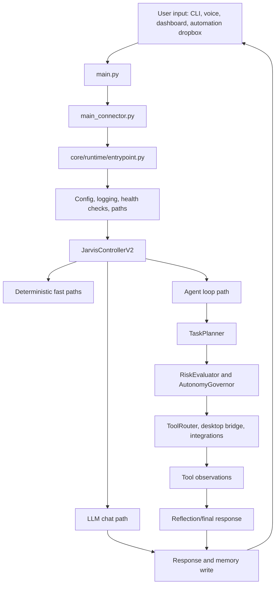

# Design Report

Generated: 2026-05-30

## Project Flow

Jarvis runs as a local AI assistant with optional voice and dashboard modes. The system is organized around a thin launcher, a runtime bootstrap layer, a controller, an agent loop, tools, memory, model routing, and safety checks.

## Startup Flow

1. `main.py` exposes the public launcher and compatibility imports.
2. `main_connector.py` parses CLI args, runs the async entrypoint, and converts top-level exceptions into exit codes.
3. `core/runtime/entrypoint.py` resolves the config path, loads config, applies CLI overrides, prepares runtime folders, initializes logging, installs exception hooks, runs health checks, and creates the controller.
4. `JarvisControllerV2.start()` initializes memory and starts background monitoring and live automation if configured.
5. If dashboard mode is enabled, `DashboardRuntime` starts FastAPI and prints the URL.
6. Runtime then waits in CLI, headless, voice, or dashboard mode until shutdown.

## Request Processing Flow

`JarvisControllerV2.process()` is the main request router.

1. Normalize user input and update dashboard state to `THINKING`.
2. Handle direct commands:
   - `status`
   - `help`
   - live automation commands such as `automation status`, `automation scan`, and `rag search ...`
3. Handle goal and preference intents without LLM planning when possible.
4. Handle active-window and desktop launcher requests through deterministic helpers.
5. If the user explicitly asks for web search, call `core.tools.web_tools.web_search` directly, then synthesize or format results.
6. If the request looks agentic and needs tools, ask `TaskPlanner` for a plan and run it through `AgentLoopEngine`.
7. Otherwise, use `LLMClientV2` for normal chat.
8. Store conversation output, update the user profile, schedule profile synthesis when needed, and update dashboard state back to `IDLE`.

## Agent Loop Flow

The agent loop is implemented in `core/agent/agent_loop.py`.

1. Move state machine into `PLANNING`.
2. Build a structured plan with `TaskPlanner`.
3. If clarification is needed, stop and ask the user.
4. Evaluate the whole plan with `RiskEvaluator`.
5. Block critical actions immediately.
6. Ask confirmation for high-impact actions.
7. For each step:
   - Check interrupt state.
   - Enforce max iteration count.
   - Evaluate step risk.
   - Ask `AutonomyGovernor` if the action is allowed.
   - Route desktop actions through `DesktopBridge`.
   - Route normal tools through `ToolRouter`.
   - Save observations.
8. Reflect over the execution trace and produce the final response.

## LLM Subsystem

The LLM subsystem lives in `core/llm`.

- `client.py`: central LLM client. Injects profile, memory, and workspace context.
- `model_router.py`: selects task-appropriate local models.
- `ollama_client.py`: local Ollama client.
- `cloud_client.py`: fallback chain for cloud providers.
- `task_planner.py`: converts goals into structured tool plans.
- `defaults.py`: default model constants.

The expected priority is local-first. Cloud providers are fallback paths when configured and local inference cannot answer.

## Memory Subsystem

The main memory implementation is in `core/memory`.

- `hybrid_memory.py`: coordinates structured and semantic memory.
- `sqlite_pool.py`: pooled SQLite access.
- `semantic_memory.py`: vector memory using Chroma.
- `embeddings.py`: embedding and code indexing support.
- `context_compressor.py`: compresses retrieved memory/context for prompts.

Memory is used for preferences, conversations, RAG/dropbox ingestion, and context blocks passed into LLM calls.

## Safety Design

Safety is deterministic and lives mainly in `core/autonomy`.

- `RiskEvaluator` classifies actions as low, medium, confirm, high, or critical.
- `AutonomyGovernor` decides whether actions are allowed under current policy.
- Integration registry can register tool risk metadata so external service tools become part of the same safety system.
- GUI and app-launch capabilities are controlled through config flags such as `allow_gui_automation` and `allow_app_launch`.

The design goal is that LLM output cannot directly bypass risk controls.

## Tool And Integration Flow

Tool execution goes through `core/tools/tool_router.py`.

1. Tools are registered by name.
2. `ToolRouter.execute()` checks the per-goal call limit.
3. It runs sync tools in a worker thread and async tools directly.
4. It enforces a timeout.
5. It normalizes results into `ToolObservation`.

External integrations are organized under `integrations`.

1. Each integration implements the base contract.
2. `IntegrationRegistry` registers integrations and maps tool names to owners.
3. Integration tools expose risk metadata.
4. Execution result is normalized to `success`, `data`, and `error`.

## Dashboard Flow

Dashboard code lives in `dashboard`.

- FastAPI routes handle auth, dashboard pages, command execution, goals, conversion, file view/download, and websocket state.
- Templates render page views.
- Static JS/CSS handle dashboard behavior.
- Dashboard state mirrors controller state such as current input, response, session, model, memory count, active goals, and Ollama status.

## Live Automation Flow

Live automation watches configured workspace folders:

- `workspace/jarvis_dropbox/commands`
- `workspace/jarvis_dropbox/rag`
- `outputs/screenshots`
- `outputs/screen_recordings`

It can process dropped commands, ingest RAG files, poll screen OCR, and expose search over ingested content.

## Shutdown Flow

1. Runtime receives CLI completion, dashboard/headless shutdown signal, cancellation, or exception.
2. Dashboard stops if running.
3. Controller shutdown stops monitor, live automation, due-goal task, voice layer, and legacy voice loop if present.
4. Runtime writes shutdown audit metadata and returns the final exit code.

## Design Strengths

- Good separation between launcher, runtime, controller, agent, tools, memory, and integrations.
- Strong test coverage for many subsystems.
- Deterministic safety layer exists outside the LLM.
- Local-first architecture with cloud fallback.
- Dashboard, CLI, voice, and automation entrypoints converge into the same controller.

## Design Watchpoints

- Some legacy and duplicate folders remain in the workspace and can confuse future agents.
- Dashboard still has FastAPI/Starlette deprecation warnings.
- Runtime-generated stores are mixed into the repository tree.
- The full coverage test command can exceed short command timeouts, even though the fast full suite passes.

