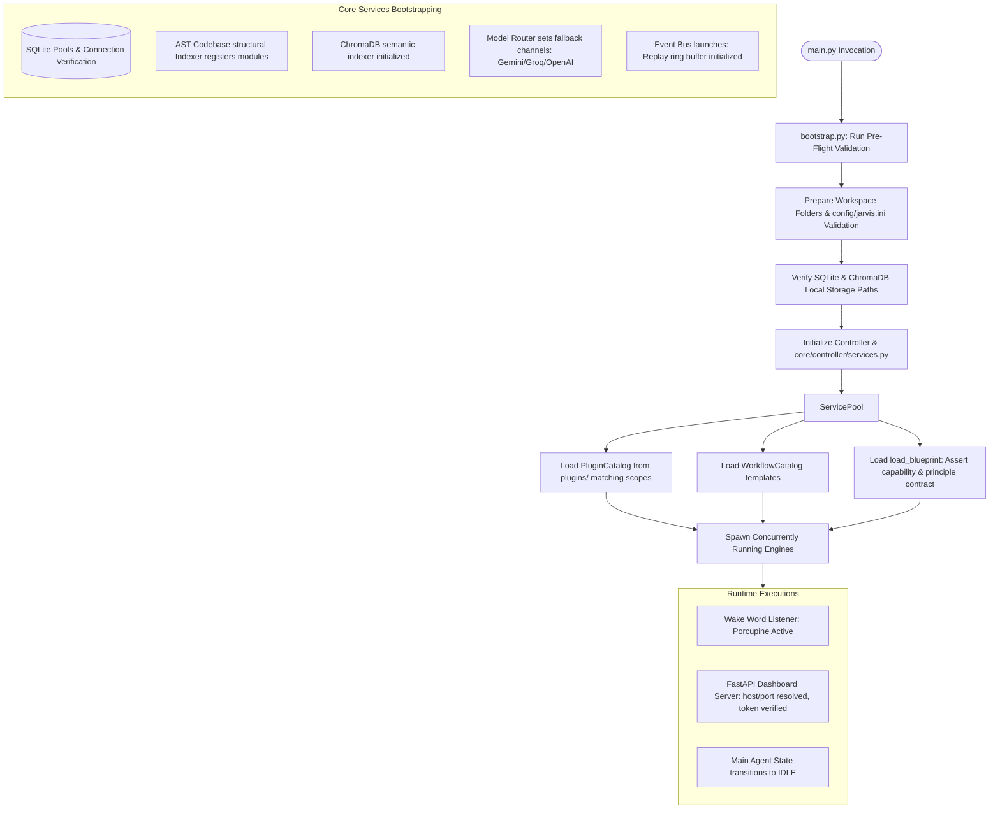

# Project Jarvis: System Architecture & Design Document
*Modular, Privacy-First Autonomous Local AI Assistant*

This document serves as the comprehensive engineering design specification for **Project Jarvis**. It details the architecture, design choices, system flows, and serves as an onboarding guide for developers and LLMs to understand the codebase.

---

## 1. Executive Summary & Core Philosophy

Project Jarvis is a modular, private-by-design local AI assistant that orchestrates desktop automation, hybrid memory, external integrations, and voice interaction. 

### Core Tenets
1. **Privacy-First**: Run computation locally using Ollama for LLM and Whisper for STT. Do not leak telemetry or inputs unless the user explicitly opts in via `config/jarvis.ini`.
2. **Graceful Fallbacks**: Ensure high uptime by falling back to high-capacity cloud APIs (Gemini, Groq, OpenAI, Anthropic) if local hardware is overloaded or models are missing.
3. **Safety & Autonomy Governance**: Act as an autonomous agent but maintain strict deterministic boundaries. Plan, risk-assess, require confirmation for side effects, and block destructive actions.
4. **Rich Contextual Memory**: Maintain user preferences, episodic memories, and codebase structural indexing via a hybrid SQL + Semantic Vector database.

---

## 2. System Architecture

Below is a premium, high-fidelity system architecture blueprint illustrating how the local AI OS and modular subsystems connect, from local Ollama model routing to hybrid SQLite relational + Chroma vector storage, hands-free voice engine, and physical desktop click/type drivers:


### 2.1 State Machine Lifecycle
The agent execution follows a strict lifecycle governed by the state machine in `core/state_machine.py`:

| State | Purpose | Transition Trigger |
| :--- | :--- | :--- |
| `IDLE` | Awaiting next command or trigger | Command received -> Transitions to `THINKING` |
| `THINKING` | Analyzing input and checking requirements | Internal routing -> `PLANNING` |
| `PLANNING` | Decomposing goal into executable steps | Plan generated -> `RISK_EVALUATION` |
| `RISK_EVALUATION` | Checking steps against security policy | High-risk step -> `AWAITING_CONFIRMATION` / Safe step -> `ACTING` |
| `AWAITING_CONFIRMATION` | Paused, waiting for user confirmation | User approved -> `ACTING` / Rejected -> `IDLE` |
| `ACTING` | Dispatching action parameters to specific tool | Tool execution starts -> `OBSERVING` |
| `OBSERVING` | Receiving tool output and formatting result | Step done -> Loops back to `ACTING` (or `REFLECTING` if done) |
| `REFLECTING` | Evaluating full execution trace against goal | Synthesizing final response -> `SPEAKING` |
| `SPEAKING` | Translating text into speech output | Output complete -> `IDLE` |
| `ERROR` | Handling tool, plan, or validation failures | Logs diagnostics -> Resets back to `IDLE` (or `SHUTDOWN` if fatal) |

On any tool failure, parsing issue, risk validation block, or unhandled exception, the machine immediately transitions to `ERROR`. From the `ERROR` state, the agent attempts to log diagnostics, notify the user, and transition back to `IDLE` (or trigger `SHUTDOWN` if the critical integrity of the system is compromised).

---

## 3. Subsystem Breakdown & Implementation Details

### 3.1 LLM & Routing Subsystem (`core/llm/`)
Prompt orchestration flows through a unified three-step pipeline:
1. **`LLMClientV2` (client.py)**: Single entry point. Manages profile injection (user communication preferences), workspace context injection (compact folder maps to ground the model), and semantic memory recall injection (queries `HybridMemory` directly).
2. **`ModelRouter` (model_router.py)**: Routes tasks to specific model tiers based on cost/performance tradeoffs.
    * *Tier 1: Intent & Synthesis* (Fast, small): `qwen2.5:0.5b`, `llama3.2:1b`, `gemma3:1b`.
    * *Tier 2: General Chat* (Medium, balanced): `mistral:7b`.
    * *Tier 3: Plan & Reason* (High capacity): `deepseek-r1:8b` or cloud engines.
3. **Clients**:
    * **`OllamaClient`**: Pulls and manages local models, communicating via local HTTP endpoints. Strips `<think>` tags dynamically if streaming.
    * **`CloudLLMClient`**: Automatic failover queue: **Google Gemini** (primary cloud fallback) $\rightarrow$ **Groq** $\rightarrow$ **OpenAI** $\rightarrow$ **Anthropic**.

### 3.2 Agentic Loop Engine (`core/agent/`)
The `AgentLoopEngine` manages multi-step tasks autonomously. For any user goal:
1. Calls `TaskPlanner` to synthesize a structured JSON list of steps.
2. Runs the step sequence through the `RiskEvaluator`.
3. Checks executing parameters against `AutonomyGovernor` rules.
4. Executes tools synchronously or asynchronously. If a desktop action (e.g. OCR scan or click target) is triggered, it redirects to the `DesktopBridge` to handle OCR target validation and screen feedback.
5. Injects tool execution observations into the context, checking for failures, and dynamically triggers the reflection engine to generate a response or correction.

#### 3.2.1 Task Planner (`core/planner/planner.py`)
The `TaskPlanner` ingests user prompt goals and dynamic system environment parameters (such as the workspace layout or active screen window) to formulate an execution plan. It fetches tool specifications from `SYSTEM_TOOL_SCHEMA`, filtering out GUI tools if the `allow_gui_automation` key is set to `False` in the execution configuration of `config/jarvis.ini`. 

The planner generates plans that adhere to a stable JSON schema, ensuring consistent downstream parsing:

```json
{
  "intent": "Open Chrome and search for local weather",
  "summary": "Planning a sequence to launch a browser and execute search actions.",
  "confidence": 0.95,
  "steps": [
    {
      "id": 1,
      "action": "launch_application",
      "description": "Start the Google Chrome application",
      "params": {
        "app_name": "chrome"
      }
    },
    {
      "id": 2,
      "action": "web_search",
      "description": "Perform web search for local weather",
      "params": {
        "query": "local weather"
      }
    }
  ],
  "clarification_needed": false,
  "clarification_prompt": "",
  "tools_required": ["launch_application", "web_search"],
  "risk_level": "medium",
  "confirmation_required": true
}
```

### 3.3 Hybrid Memory Subsystem (`core/memory/`)
Memory is designed as a hybrid relational and semantic storage:
* **SQLite (sqlite_pool.py & hybrid_memory.py)**: Manages fast structural indexing. Stores persistent user configuration/preferences, chat episode history, and transactional action logs. Powered by a connection pooler to prevent thread blockages.
* **ChromaDB (semantic_memory.py)**: Holds vector embeddings (generated via `all-MiniLM-L6-v2`) of preferences, conversation turns, and codebase chunks.
* **Codebase Structural Vectorizer**: Reads and parses Python files inside the workspace using the standard `ast` module. Splits them into logical classes and functions, registers their hashes in SQLite, and indexes them semantically in ChromaDB. This allows Jarvis to understand its own codebase structure dynamically during operation!

### 3.4 Security & Risk Governance (`core/autonomy/`)
Safety is handled deterministically via table-driven constraints in `RiskEvaluator` and `AutonomyGovernor`:
* **CRITICAL/FORBIDDEN Actions**: Operations like `shell_exec`, direct file deletion (`rm`, `rmdir`), and direct registry edits are blocked unconditionally in the current implementation to prevent unmitigated host damage.
* **HIGH-RISK Actions**: Package installs, subprocess spawning, and complex application launches trigger strict risk warnings.
* **CONFIRM Actions**: Actions with external side-effects (sending WhatsApp/emails, updating Notion, playing Spotify, clicking/typing on the GUI, toggling IoT entities) trigger an asynchronous or console confirmation callback, requiring user input (`y/n`) before execution.

This strict rule-based barrier is hardcoded and cannot be bypassed by prompt tweaking.

### 3.5 Voice & Speech Subsystem (`core/voice/`)
Jarvis contains a complete sound and speech processing pipeline for hands-free local control:
* **Speech-To-Text (STT)**: Utilizes Whisper locally via a dedicated `WhisperSTT` interface, providing private speech translation. It falls back to the `Google Speech API` in case of local GPU bottlenecks, or automatically displays a CLI typing fallback to maintain interaction.
* **Text-To-Speech (TTS)**: Connects to `edge-tts` to stream human-sounding speech from premium online neural voices. If offline, the pipeline falls back gracefully to `pyttsx3`, utilizing native Windows/macOS/Linux speech synthesis.
* **Wake Word Engine**: Embeds Picovoice Porcupine to run low-CPU local audio listening, awakening the core controller out of an `IDLE` state upon hearing the configured wake word ("Jarvis").

---

## 4. Why We Added These Components (Architecture Rationale)

Each module in Jarvis is built to address specific real-world challenges encountered by autonomous desktop agents:

| Feature | Why We Added It | Technical Rationale |
| :--- | :--- | :--- |
| **Model Tiers & Router** | Cost and Latency balance | Running a 7B reasoning model for simple intent classification or text summarization is highly inefficient and creates severe latency (several seconds). Routing simple tasks to a 1B model and planning to a reasoning model optimizes responsiveness. |
| **Deterministic Risk Table** | Safety & predictability | LLMs are notoriously prone to prompt injections or hallucinated arguments that can result in executing destructive shell commands. A hardcoded table-driven guard ensures that security constraints are absolute and cannot be bypassed by prompt tweaking. |
| **Hybrid Memory Model** | Speed, history, and search | ChromaDB is great for semantic "vibe" search but extremely poor at querying structural key-values (e.g. `user_name = Jarvis`). Combining SQLite (for precise preferences) and ChromaDB (for broad topic search) offers the best of both worlds. |
| **AST Codebase Indexing** | Local self-awareness | To allow Jarvis to debug or extend itself, it needs to understand what modules exist. AST parsing extracts precise classes and functional blocks, indexing them semantically so Jarvis can answer "where is the Spotify token checked?" without loading millions of lines. |
| **Desktop OCR Bridge** | Dynamic interface targeting | GUI coordinates shift based on screen scale and window positions. The `DesktopBridge` uses OCR to find targets by text (e.g. "Submit Button") rather than using fixed coordinate offsets, making clicks highly robust. |

---

## 5. Future Additions & Enhancements Roadmap

To evolve Project Jarvis into a next-generation desktop companion, we can implement the following enhancements:

### 5.1 Multi-Agent Collaboration
* **Implementation**: Introduce specialized sub-agents (e.g., *DevAgent*, *ResearchAgent*, *SystemAgent*) managed by the `AgentLoopEngine` as tools.
* **Benefit**: Segregates prompts and tools, reducing context window clutter and boosting success rates on highly complex, multi-domain tasks.

### 5.2 Secure OS Sandboxing
* **Implementation**: Wrap shell commands and file tools in a Docker container or Windows Sandbox instance (using WSL2 or hypervisor isolation APIs).
* **Benefit**: Allows Jarvis to safely run high-risk commands and test scripts without any possibility of corrupting the host machine.

### 5.3 Semantic Tool Selection (Dynamic Tool Matching)
* **Implementation**: Index all registered tool descriptions semantically in ChromaDB. Instead of feeding 50 tool schemas to the model at once, Jarvis can retrieve the top 5 most relevant tool schemas based on the current goal.
* **Benefit**: Saves huge amounts of context tokens and prevents the LLM from getting confused by excessively large tool configurations.

### 5.4 Advanced Voice Modeling (Local TTS/STT upgrades)
* **Implementation**: Integrate Kokoro-82M (a highly lightweight, premium local TTS) or Whisper-turbo to replace edge-tts (which requires internet connectivity) and pyttsx3 (which sounds robotic).
* **Benefit**: Achieves high-fidelity, emotional voice synthesis and ultra-fast voice transcription entirely offline.

### 5.5 Visual Interface State Tracking
* **Implementation**: Hook up a lightweight local vision-language model (VLM) like `minicpm-v` or `qwen2-vl` inside the `DesktopBridge`.
* **Benefit**: Allows the agent to visually inspect screen layouts and interact with images, diagrams, and non-textual UI elements, moving beyond pure OCR.

---

## 6. Technical Context & Bootstrap Guide for LLMs

*Copy and paste the prompt below into any LLM conversation to immediately bring it up to speed on Project Jarvis:*

```markdown
You are an expert software engineer specializing in Python agentic frameworks. You are working on "Project Jarvis", a privacy-first, modular local AI assistant. Here is a high-level overview of the codebase to ground your implementations:

1. CORE LIFE CYCLE (main.py -> core/runtime/entrypoint.py -> controller_v2.py)
- Runs an event loop managing Voice inputs, Web GUI updates, and the Agent Loop.
- Maintains a persistent StateMachine: IDLE -> THINKING -> PLANNING -> RISK_EVALUATION -> AWAITING_CONFIRMATION -> ACTING -> OBSERVING -> REFLECTING -> SPEAKING -> IDLE.
- If any component fails or is hard-blocked, the state machine transitions to the ERROR state before resetting to IDLE or SHUTDOWN.

2. LLM SUBSYSTEM (core/llm/)
- LLMClientV2 (client.py) is the entry point. It resolves prompts, injects workspace lists and memory contexts, and communicates with HybridMemory.
- ModelRouter (model_router.py) maps task_types ('intent', 'planning', 'summarize', 'chat') to distinct Ollama models (e.g., qwen2.5:0.5b for intent, mistral:7b for chat, deepseek-r1:8b for planning) and falls back to a chain of cloud clients (Gemini -> Groq -> OpenAI -> Anthropic) if local Ollama fails.

3. AGENT ENGINE (core/agent/agent_loop.py)
- Executes TaskPlanner (`core/planner/planner.py`) steps in an iterative loop.
- The TaskPlanner outputs a structured JSON plan (containing summary, confidence, steps list, confirmation details, and risk ratings) while dynamically filtering out GUI tools if allow_gui_automation is disabled in configuration.
- Performs risk checks on every action before execution.
- Redirects desktop actions to the DesktopBridge.
- Synthesizes execution trace into a final reflection using the reflection engine.

4. SAFETY GOVERNOR (core/autonomy/)
- RiskEvaluator maps actions into levels: LOW, MEDIUM, CONFIRM, HIGH, CRITICAL.
- CRITICAL actions (e.g., shell, rm, registry write) are blocked unconditionally in the current implementation.
- CONFIRM actions (e.g., write_file, outbound emails, click, type) pause the execution loop and request user confirmation via callbacks.

5. HYBRID MEMORY & AST PARSING (core/memory/)
- SQLite serves as the relational engine, caching fact lists, episodic turns, and logged tool execution actions. All SQLite operations utilize a thread-safe pool (sqlite_pool.py) to prevent lock contention.
- ChromaDB handles semantic vector memory using SentenceTransformers embeddings (all-MiniLM-L6-v2) to perform semantic searches over preferences and episodes.
- An AST-based code parser (hybrid_memory.py / semantic_memory.py) indexes the active workspace codebase. It breaks Python scripts down into class and function units and registers them semantically, enabling Jarvis to be self-aware of its own code structure.

When writing or refactoring code for this project:
- Respect the existing models configuration under config/jarvis.ini.
- Do not import models or controllers directly inside llm or memory packages to prevent import cycles.
- Always use the SQLitePool (sqlite_pool.py) connection context when interacting with the database.
- Keep components modular, and ensure that all new tool additions are registered via `core/registry/registry.py`.
```

---

## 7. Codebase Directory Hierarchy

Below is the complete, structured directory tree of the **Project Jarvis** workspace, illustrating the modular separation of concerns between core capabilities, automation triggers, memory models, and interfaces:

```text
Jarvis/
├── config/                  # Declarative configurations and runtime preferences
│   ├── jarvis.ini           # Main configuration file (models, memory, security, plugins, etc.)
│   └── ai_os.json           # Blueprint configurations outlining AI OS layers & core principles
├── core/                    # Unified Core Subsystems
│   ├── agent/               # Autonomous execution loop and planning
│   │   ├── agent_loop.py    # Main execution coordinator resolving goals step-by-step
│   │   └── task_planner.py  # Structured JSON plan generation via advanced LLM prompting
│   ├── ai_os/               # Blueprint foundation and AI OS engine
│   │   └── blueprint.py     # Declares layer rules, capability checks, and principle assertions
│   ├── autonomy/            # Safety guards, risk assessment, and policy limits
│   │   ├── risk_evaluator.py # Table-driven execution risk evaluation (LOW to CRITICAL)
│   │   └── autonomy_governor.py # Rule checkers ensuring strict containment of agent side effects
│   ├── controller/          # Top-level state and system orchestrator
│   │   ├── services.py      # Core service initialization (llm, memory, voice, workspace)
│   │   └── intents.py       # Fast, deterministic router for quick classification and handling
│   ├── desktop/             # Structs and contracts for desktop automation UI models
│   ├── execution/           # Asynchronous task managers and action dispatch pipelines
│   ├── hardware/            # Integrations for physical devices and serial controllers
│   ├── introspection/       # Internal self-checking and system health modules
│   ├── llm/                 # Model interaction clients and intelligence routers
│   │   ├── client.py        # Central LLM client injecting context, memory, and code maps
│   │   ├── model_router.py  # Dynamic task router utilizing specialized model tiers
│   │   ├── ollama_client.py # Local HTTP client for fast, private offline computation
│   │   └── cloud_client.py  # Failover client chain (Gemini -> Groq -> OpenAI -> Anthropic)
│   ├── memory/              # Relational and vector semantic database pools
│   │   ├── hybrid_memory.py # Relational + semantic coordinate interface
│   │   ├── semantic_memory.py # ChromaDB vector vectorization & search
│   │   ├── sqlite_pool.py   # Thread-safe pooled SQLite database connection context
│   │   └── embeddings.py    # Codebase structural parser split by classes and functions (AST)
│   ├── plugins/             # Extensible plugin catalog architecture
│   │   └── manifest.py      # Metadata-first parser ensuring secure scope constraints
│   ├── runtime/             # System initialization and event bus pipelines
│   │   ├── bootstrap.py     # Runtime folder generation and pre-flight path validation
│   │   └── event_bus.py     # Lightweight pub/sub message bus with replay ring-buffer
│   ├── security/            # Session token keys, password encryption, and auth checks
│   ├── tools/               # Universal actions database
│   │   ├── registry.py      # Centralized registration metadata schemas and decorators
│   │   ├── screen.py        # Screen capture, OCR target location, and vision utilities
│   │   ├── web_tools.py     # Private duckduckgo search, browser scrapers, and file downloaders
│   │   └── gui_control.py   # Low-level mouse clicking, keyboard typing, and window positioning
│   ├── voice/               # Hands-free speech interface pipeline
│   │   ├── wake_word.py     # Picovoice wake-word listener monitoring audio input
│   │   ├── stt.py           # Whisper local STT model with cloud transcription backup
│   │   └── tts.py           # Neural online voice streaming with local pyttsx3 voice backup
│   └── workflow/            # Declarative multi-step workflows
│       └── catalog.py       # Schema validation and execution of templated workflow JSONs
├── dashboard/               # Frontend Control Web Interface
│   ├── server.py            # FastAPI application server, auth endpoints, and status APIs
│   ├── templates/           # Layout HTML views, AI OS inspector, and active dashboard panels
│   └── static/              # Harmanious dark-themed CSS, dynamic charts, and socket listeners
├── plugins/                 # Local directory for discovering standalone plugins
├── workflows/               # Workspace workflow templates directory
│   └── templates/           # Declarative JSON workflow definitions
└── tests/                   # Extensive test suites for robust feature coverage
```

---

## 8. Core System Flowcharts

To understand how Jarvis loads, runs, and dispatches messages, review the three fundamental operational flows detailed below:

### 8.1 System Bootstrapping Flow
This diagram details the startup sequence inside `core/runtime/bootstrap.py` leading to concurrent dashboard and voice engines:



---

### 8.2 Agentic Request-Response Execution Flow
Here is the high-fidelity conceptual visual mapping how input commands (voice or web dashboard API) flow through fast intent routing, hybrid AST memory retrieval, JSON task planning step generations, strict risk table assessment (LOW, CONFIRM, HIGH, CRITICAL), desktop click/type action coordinates alignment, reflection, and neural voice synthesis output:


---

### 8.3 Event Bus Pub/Sub & Replay Flow
This diagram details the lightweight, asynchronous message bus executing inside `core/runtime/event_bus.py`, ensuring completely decoupled communications:

```mermaid
flowchart TD
    %% Publish Events
    Source[Component: Controller / Agent Loop / Dashboard / Voice] -->|publish event_type, payload, source| Publish[EventBus.publish()]
    
    %% Event Recording
    Publish --> Record[Create EventRecord: Generate Event UUID & timestamp]
    Record --> HistoryCheck{Is maxlen > 0?}
    HistoryCheck -->|Yes| Buffer[Append to circular replay deque history buffer]
    HistoryCheck -->|No| SubMap[Lookup listener subscriptions]
    Buffer --> SubMap
    
    %% Subscription Dispatch
    SubMap --> Match{Match listeners targeting event_type or wildcard '*'}
    
    Match -->|No Match| End([Dispatch Finished])
    Match -->|Matches Found| Dispatch[Dispatch Callback Loop]
    
    %% Thread & Coroutine Handling
    Dispatch --> RunType{Is Callback Coroutine?}
    RunType -->|No: Synchronous Function| SyncExec[Execute callback sync on thread]
    RunType -->|Yes: Coroutine| LoopCheck{Is Event Loop Running?}
    
    LoopCheck -->|Yes| CreateTask[loop.create_task: Dispatch asynchronously]
    LoopCheck -->|No| SyncFallback[logger.warning: run synchronously using asyncio.run fallback]
    
    SyncExec & CreateTask & SyncFallback --> End
    
    %% Replays
    Replayer[Introspection Engine] -->|replay query by type or source| GetHistory[EventBus.replay()]
    GetHistory --> Filter[Filter history buffer records]
    Filter --> Results([Return chronological EventRecords])
```

---

### 8.4 AI OS Web Dashboard & Telemetry Monitor
This high-fidelity dashboard user interface layout outlines how developers and administrators inspect running model latency, activate/deactivate plugins, check JSON templates executions, monitor hardware health, and review the live event bus pub/sub streaming in real-time:


