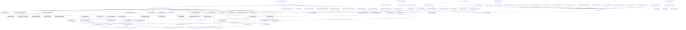

# Monolith Dependency Graph

```mermaid
graph TD;
    main --> core_runtime_entrypoint;
    main --> core_runtime_bootstrap;
    core_controller_v2 --> core_controller_goal_runner;
    core_controller_v2 --> core_controller_automation_manager;
    core_controller_v2 --> core_controller_llm_dispatcher;
    core_controller_v2 --> core_controller_memory_subsystem;
    core_controller_v2 --> core_controller_intent_router;
    core_controller_v2 --> core_base_controller;
    core_controller_v2 --> core_controller_llm_orchestrator;
    core_controller_v2 --> core_llm_defaults;
    core_controller_v2 --> core_controller_services;
    core_controller_v2 --> core_controller_intents;
    core_agent_agent_loop --> core_registry_registry;
    core_agent_agent_loop --> core_autonomy_risk_evaluator;
    core_agent_agent_loop --> core_state_machine;
    core_agent_agent_loop --> core_autonomy_autonomy_governor;
    core_agent_agent_loop --> core_metrics_confidence;
    core_agent_agent_loop --> core_context_context;
    core_agent_agent_loop --> core_planner_planner;
    core_agentic_goal_manager --> core_autonomy_goal_manager;
    core_automation_live_automation --> core_automation_scan_rules;
    core_automation_live_automation --> core_automation_scan_pipeline;
    core_automation_live_automation --> core_runtime_paths;
    core_automation___init__ --> core_automation_live_automation;
    core_capability_base --> core_context_context;
    core_capability_base --> core_autonomy_risk_evaluator;
    core_context_context --> core_state_machine;
    core_context_context --> core_logging_logger;
    core_context___init__ --> core_context_context;
    core_controller_intent_handlers --> core_controller_web_search;
    core_controller_intent_handlers --> core_controller_request_rules;
    core_controller_intent_handlers --> core_desktop_shortcuts;
    core_controller_services --> core_registry_registry;
    core_controller_services --> core_llm_model_router;
    core_controller_services --> core_llm_telemetry;
    core_controller_services --> core_desktop_actions;
    core_controller_services --> core_llm_defaults;
    core_controller_services --> core_synthesis;
    core_controller_services --> core_agent_agent_loop;
    core_controller_services --> core_autonomy_scheduler;
    core_controller_services --> core_state_machine;
    core_controller_services --> core_autonomy_risk_evaluator;
    core_controller_services --> core_autonomy_goal_manager;
    core_controller_services --> core_autonomy_autonomy_governor;
    core_controller_services --> core_profile;
    core_controller_services --> core_tools_builtin_tools;
    core_controller_services --> core_runtime_event_bus;
    core_controller_services --> core_runtime_paths;
    core_controller_services --> core_desktop_observation;
    core_controller_services --> core_memory_hybrid_memory;
    core_controller_services --> core_llm_client;
    core_controller_services --> core_proactive_background_monitor;
    core_controller_services --> core_planner_planner;
    core_controller_services --> core_proactive_notifier;
    core_controller_web_search --> core_controller_request_rules;
    core_desktop_actions --> core_autonomy_risk_evaluator;
    core_desktop_actions --> core_desktop_contracts;
    core_desktop_mission --> core_desktop_observation;
    core_desktop_mission --> core_desktop_actions;
    core_desktop_mission --> core_desktop_contracts;
    core_desktop_observation --> core_desktop_contracts;
    core_desktop_shortcuts --> core_desktop_observation;
    core_desktop_shortcuts --> core_tools_system_automation;
    core_desktop_shortcuts --> core_desktop_actions;
    core_desktop_shortcuts --> core_desktop_mission;
    core_desktop_shortcuts --> core_desktop_contracts;
    core_desktop___init__ --> core_desktop_mission;
    core_desktop___init__ --> core_desktop_actions;
    core_desktop___init__ --> core_desktop_observation;
    core_desktop___init__ --> core_desktop_contracts;
    core_execution_dispatcher --> core_executor_engine;
    core_executor_engine --> core_context_context;
    core_executor_engine --> core_executor_dag;
    core_hardware_device_registry --> core_hardware_serial_controller;
    core_introspection_health --> core_ops_production;
    core_introspection_health --> core_runtime_paths;
    core_llm_client --> core_llm_ollama_client;
    core_llm_client --> core_config_defaults;
    core_llm_client --> core_llm_defaults;
    core_llm_client --> core_llm_model_router;
    core_llm_model_router --> core_llm_ollama_client;
    core_llm_model_router --> core_config_defaults;
    core_llm_model_router --> core_llm_model_spec;
    core_llm_ollama_client --> core_config_defaults;
    core_llm_ollama_client --> core_llm_defaults;
    core_llm___init__ --> core_llm_model_router;
    core_llm___init__ --> core_llm_model_spec;
    core_llm___init__ --> core_llm_telemetry;
    core_llm___init__ --> core_llm_ollama_client;
    core_llm___init__ --> core_llm_client;
    core_llm___init__ --> core_llm_cloud_client;
    core_memory_hybrid_memory --> core_memory_semantic_memory;
    core_memory_hybrid_memory --> core_memory_sqlite_pool;
    core_memory_hybrid_memory --> core_memory_sqlite_storage;
    core_memory_hybrid_memory --> core_memory_code_indexer_service;
    core_memory_hybrid_memory --> core_memory_retriever;
    core_planner_planner --> core_autonomy_risk_evaluator;
    core_registry_base --> core_context_context;
    core_registry_base --> core_capability_base;
    core_registry_registry --> core_autonomy_risk_evaluator;
    core_registry_registry --> core_context_context;
    core_registry_registry --> core_capability_base;
    core_registry_registry --> core_desktop_mission;
    core_registry_registry --> core_desktop_contracts;
    core_registry___init__ --> core_registry_registry;
    core_runtime_bootstrap --> core_ops_production;
    core_runtime_bootstrap --> core_runtime_paths;
    core_runtime_entrypoint --> core_runtime_bootstrap;
    core_runtime_entrypoint --> core_runtime_paths;
    core_runtime_entrypoint --> core_runtime_dashboard_runtime;
    core_runtime_entrypoint --> core_introspection_health;
    core_runtime___init__ --> core_runtime_bootstrap;
    core_security___init__ --> core_security_auth;
    core_tools_auto_clicker --> core_tools_gui_control;
    core_tools_builtin_tools --> core_tools_path_utils;
    core_tools_gui_control --> core_types_common;
    core_tools_hardware_tools --> core_types_common;
    core_tools_screen --> core_types_common;
    core_types___init__ --> core_types_common;
    core_voice_voice_layer --> core_voice_voice_loop;
    core_voice_voice_loop --> core_voice_wake_word;
    core_voice_voice_loop --> core_voice_tts;
    core_voice_voice_loop --> core_voice_stt;
    integrations_base --> core_types_common;
    integrations_loader --> integrations_base;
    integrations_registry --> integrations_base;
    integrations___init__ --> integrations_registry;
    integrations_clients_calendar --> integrations_base;
    integrations_clients_computer_control --> integrations_base;
    integrations_clients_email --> integrations_base;
    integrations_clients_github --> integrations_base;
    integrations_clients_gmail --> integrations_base;
    integrations_clients_google_calendar --> integrations_base;
    integrations_clients_home_assistant --> integrations_base;
    integrations_clients_notion --> integrations_base;
    integrations_clients_spotify --> integrations_base;
    integrations_clients_telegram --> integrations_base;
    integrations_clients_template --> integrations_base;
    integrations_clients_weather --> integrations_base;
    integrations_clients_whatsapp --> integrations_base;
```
